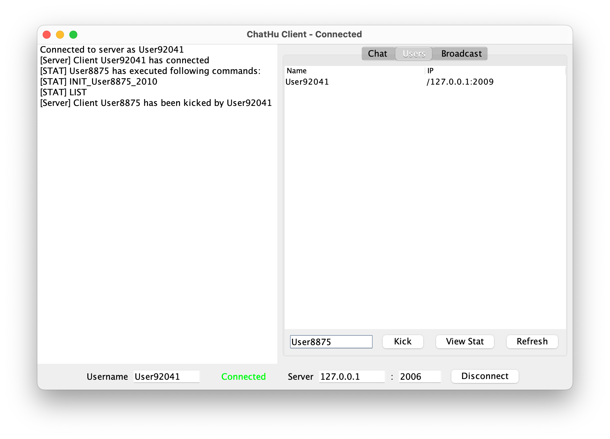
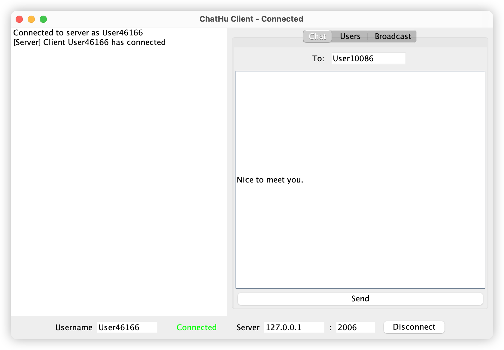
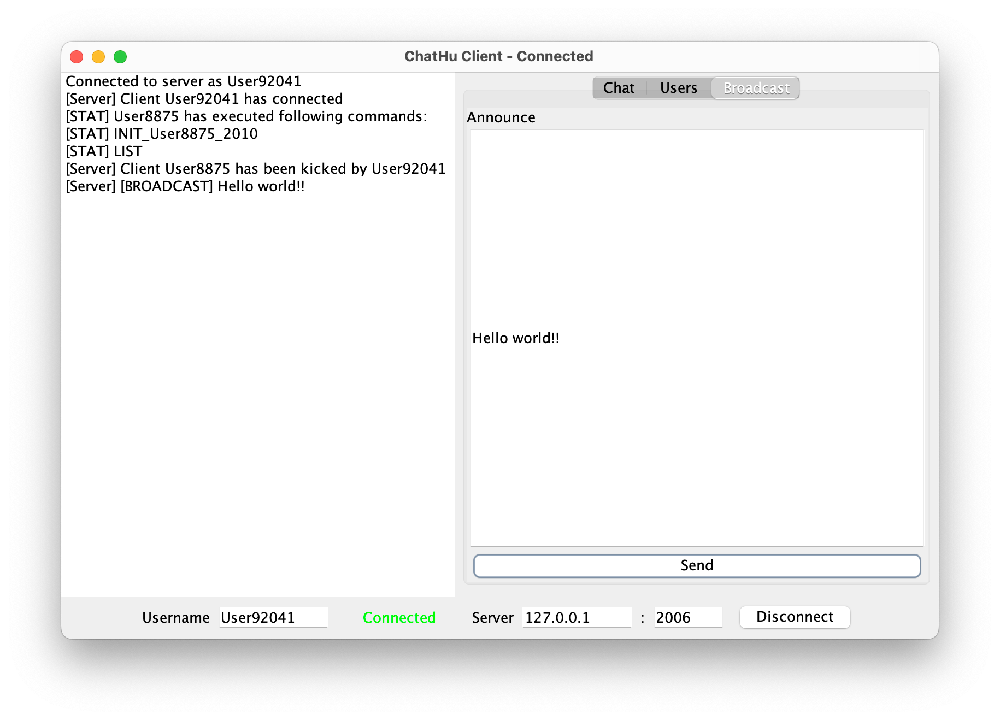
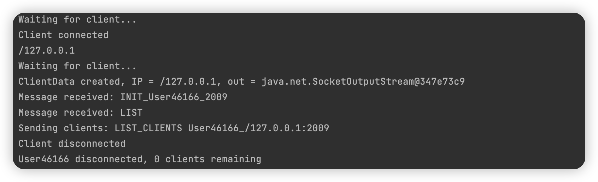

# ChatHu P2P Chatting System

ChatHu is a peer-to-peer (P2P) chat application that leverages a central server for user management while providing direct communication channels between clients. The system is designed with a focus on asynchronous operation, non-blocking I/O, and thread safety, ensuring a robust and efficient user experience.

## Architecture Overview

The ChatHu system comprises two primary components:

- **Server**: Acts as the central node for user registration, authentication, and peer discovery.
- **Client**: Provides a user interface for message exchange and implements direct peer-to-peer communication.

## Server

The server component of ChatHu is engineered for concurrent client handling, with a breakdown into several modules:

- **Server Main**: Listens for incoming client connections and spawns new threads for individual client handling.
- **ClientHandler**: Manages client requests, processes commands, and maintains communication with the connected client.
- **ClientData**: Stores client-related information such as username, IP address, port, and a history of executed commands.
- **ClientMap**: A thread-safe collection that maps usernames to their corresponding ClientData objects for quick lookups.

## Client

The client-side of ChatHu is designed with an asynchronous architecture, allowing for a responsive user interface that can handle incoming communication without blocking user interaction.

### Key Features:

### User List and Peer Discovery

Users can easily see who is online and initiate a private chat using the user list feature. This screen shows all currently connected users along with their status.

### Private Chat

ChatHu allows for private messaging between users. The chat interface is clean and user-friendly, making communication simple and direct.

### Broadcast Messages

Need to send a message to all online users? The broadcast feature lets you communicate with everyone at once.

### Server Terminal

The server terminal provides real-time updates on user activity and system status, allowing for effective monitoring and management of the chat service.

## Getting Started

To run ChatHu, follow these steps:

1. Ensure that Java is installed on your system.
2. Clone the repository to your local machine.
3. Compile and run the server component from the `server` directory.
4. Compile and run the client component from the `client` directory.
5. Use the client UI to connect to the server, discover peers, and start chatting.

## Contributions

Contributions are welcome! If you have any features, bug fixes, or improvements, please fork the repository, make your changes, and submit a pull request.
